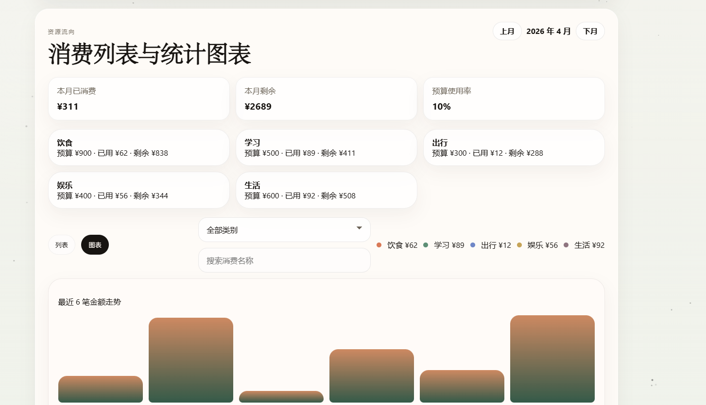

# ZY Diary


ZY Diary 是一款面向长期生活管理的个人成长应用。  
它把「每日记录」「往日复盘」「目标打卡」「消费账本」「周期报告」「提醒系统」整合在一个本地优先的系统里，帮助用户把碎片化生活数据沉淀为可回看、可追踪、可恢复的长期轨迹。

## 项目亮点

- 本地优先：核心数据默认保存在本地，支持导出/导入与恢复快照
- 双端可用：已打通 Windows 安装包与 Android Release APK
- 一体闭环：从记录、行动、消费到周/月洞察形成完整流程
- 低门槛上手：首页引导卡 + 帮助中心 + 用户名与主题配置
- 长期反馈：灵气/境界机制、统计图与周期报告持续提供正反馈

## 版本信息

- 当前版本：`1.0.1`
- Windows App ID：`com.zydiary.desktop`
- Android 包名：`com.zydiary.mobile`

## 系统功能总览

### 1. 每日记录（Daily Log）

- 记录今日完成事项、阻碍与下一步
- 支持情绪、精力、专注度状态追踪
- 与提醒系统联动，支持形成稳定节奏


### 2. 往日复盘（Review）

- 独立页面查看最近记录
- 通过日历回溯特定日期内容
- 历史复盘与状态标签同步展示


### 3. 目标打卡与奖惩（Goals）

- 自定义目标创建与打卡
- 月历视图追踪完成情况
- 奖励/惩罚转盘支持用户自定义内容


### 4. 账本与预算系统（Ledger）

- 日常消费记录与分类管理
- 月预算、分类预算、固定消费管理
- 按月份切换查看支出与预算执行情况




### 5. 成长档案与机制（Profile）

- 用户名、主题、提醒配置
- 灵气/境界成长反馈
- 数据目录查看与切换（按平台能力）


## 技术栈

- 前端：HTML / CSS / Vanilla JavaScript（模块化组织）
- 桌面：Electron
- 移动：Capacitor + Android（Gradle）
- 存储：IndexedDB / localStorage（Web）+ 桌面文件存储 + 安卓私有/文档目录存储
- 打包：
  - Windows：`electron-builder`（NSIS）
  - Android：`Gradle assembleRelease`

## 架构与目录

- `js/core/`：状态管理、存储抽象、统计与通用工具
- `js/pages/`：按页面拆分的业务逻辑
- `app.js`：静态页面加载入口（打包后运行脚本）
- `electron/`：桌面主进程与预加载桥
- `android/`：Capacitor 生成的原生 Android 工程
- `build/`：图标与安装器资源
- `dist/`：Windows 打包产物
- `PIC/`：README 展示截图

## 安装与运行

### Windows 安装包

- `dist/ZY-Diary-Setup-1.0.1.exe`

### Android Release APK

- `android/app/build/outputs/apk/release/app-release.apk`

### 本地开发（桌面）

```bash
npm install
npm run dev
```

## 构建命令

### 打包 Windows

```bash
npm run dist
```

### 同步并构建 Android

```bash
npm run android:prepare
npm run android:sync
cd android
./gradlew assembleRelease
```

## 数据与安全说明

- 默认本地存储，不依赖云端即可使用
- 支持导出 JSON 备份、导入恢复、恢复快照
- 建议在升级版本或迁移设备前先导出备份
- 安卓端按系统权限模型提供：
  - 应用私有目录
  - 设备文档目录

## 发布检查清单（建议）

- Windows 安装、启动、卸载流程正常
- Android APK 安装与存储权限流程正常
- 首页时间倒计时、引导卡、提醒功能正常
- 目标/账本/复盘/报告/档案页面联动正常
- 导出导入、目录切换、恢复快照可用

## License

MIT
